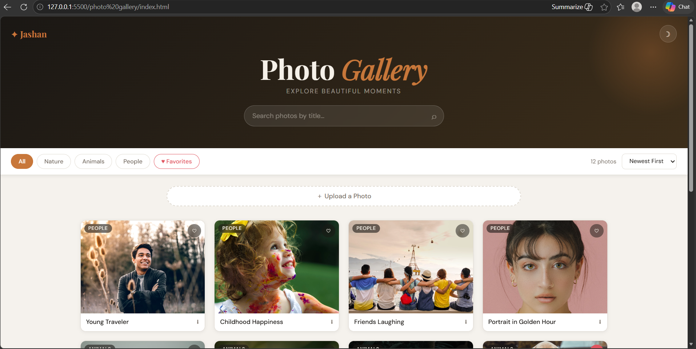
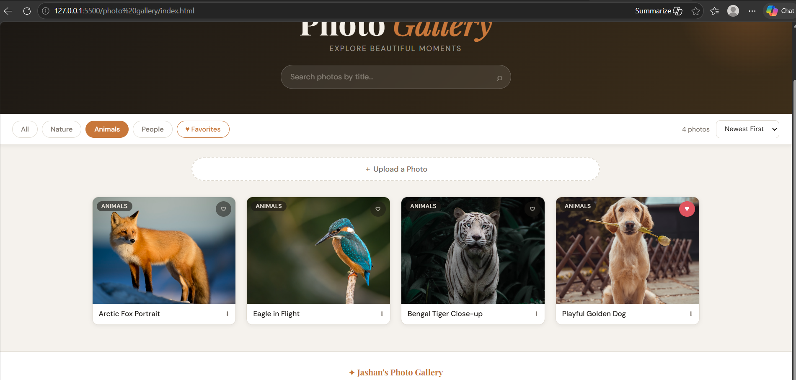
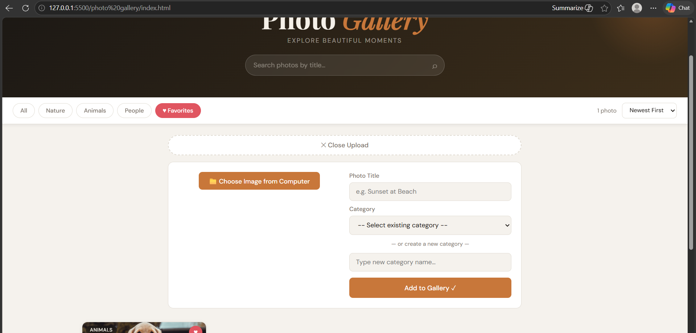
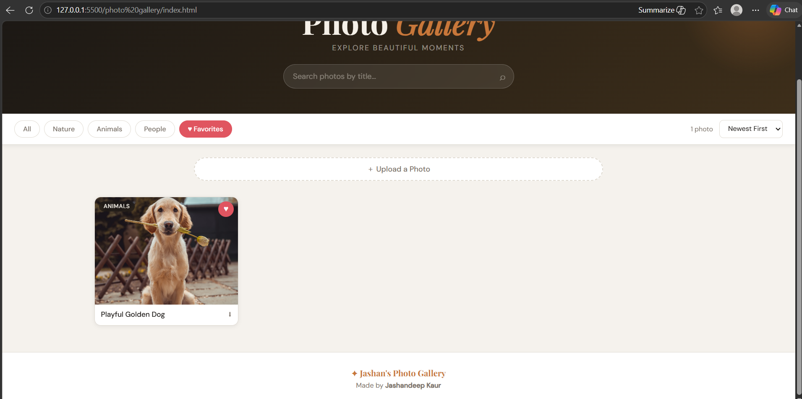
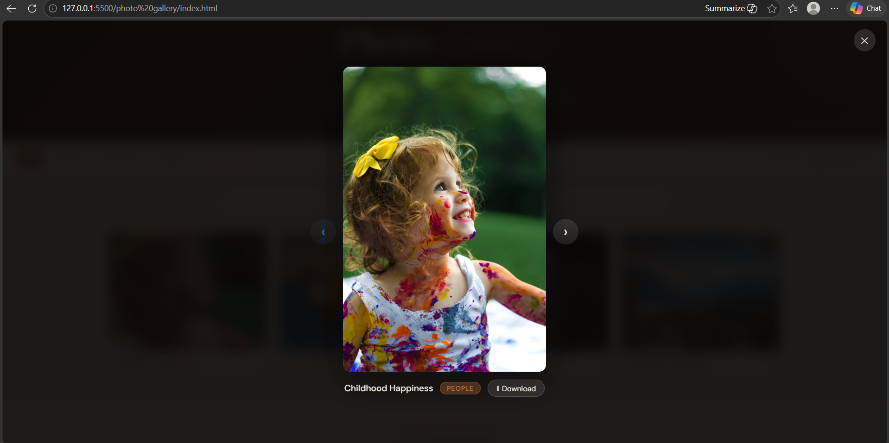
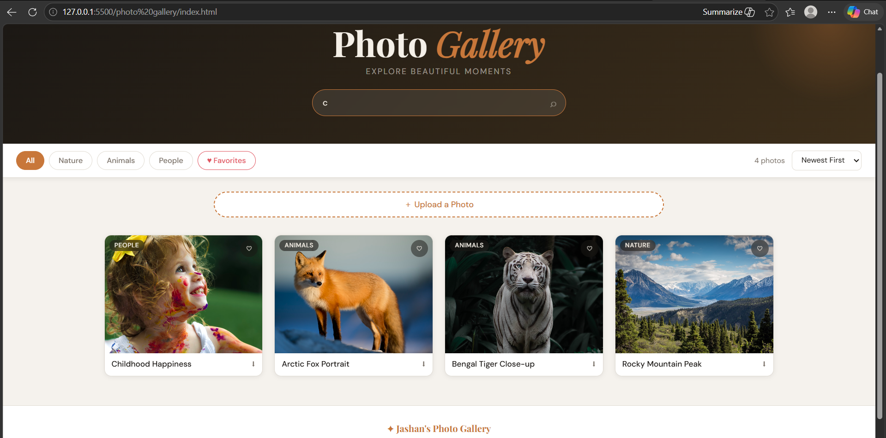

# Photo Gallery Web Application

A responsive photo gallery web application built using HTML, CSS, and JavaScript.

## Features
- Responsive gallery layout
- Category-based image filtering
- Image upload functionality
- Search images by title
- Dark mode toggle
- Lightbox fullscreen preview
- Sorting options
- Smooth animations and hover effects

## Technologies Used
- HTML5
- CSS3
- JavaScript

## Categories Included
- Nature
- Animals
- People

## How to Run
1. Download the project
2. Open folder in VS Code
3. Run "index.html" using Live Server

## Screenshots

### Start Screen

### Category Filter Feature

### Custom Image Upload Feature

### Favorite Feature

### Photo Viewing / Lightbox

### Search Feature

